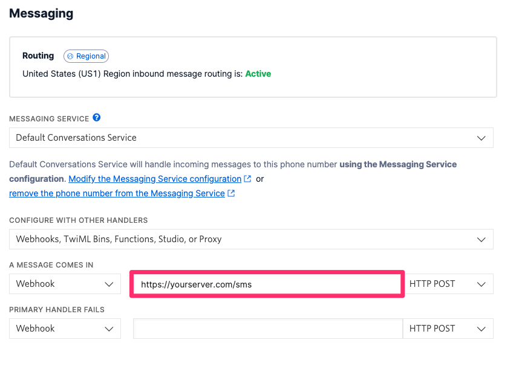

## Disaster Hotline

Names: Chloe, Masuma, Maryanne

Team: FLETCHER

[In addition to this: Map website](https://github.com/ChloeQuijano/map-page)

1. **Create a virtual environment:**

   ```bash
   python -m venv venv
   ```

2. **Activate the virtual environment:**

   - On Windows:
     ```bash
     .\venv\Scripts\activate
     ```
   - On macOS and Linux:
     ```bash
     source venv/bin/activate
     ```

3. **Install requirements within the virtual environment:**

   ```bash
   pip install -r requirements.txt
   ```

4. **Add API KEYS**
   Set up the following API keys:

- GOOGLE_MAPS_API_KEY

## Adding Twilio integration

1. Sign up for a Twilio account and get a phone number running and your phone number validated. Instructions are [here](https://www.twilio.com/docs/messaging/quickstart/python#sign-up-for---or-sign-in-to---twilio)

2. Run the Flask application by running

   ```bash
   flask --app app run
   ```

3. Set up ngrok to get a working URL for twilio. Instructions are [here](https://www.twilio.com/docs/usage/tutorials/how-to-set-up-your-python-and-flask-development-environment#install-ngrok)

4. Update the Twilio messaging forward URL to your ngrok URL and add '/sms' at the end
   
   [Source](https://www.twilio.com/docs/messaging/tutorials/how-to-receive-and-reply/python#configure-your-webhook-url)
